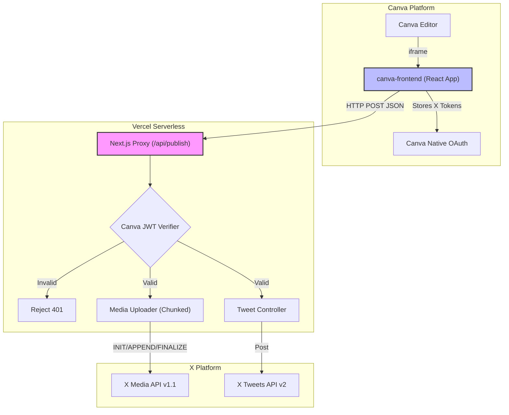
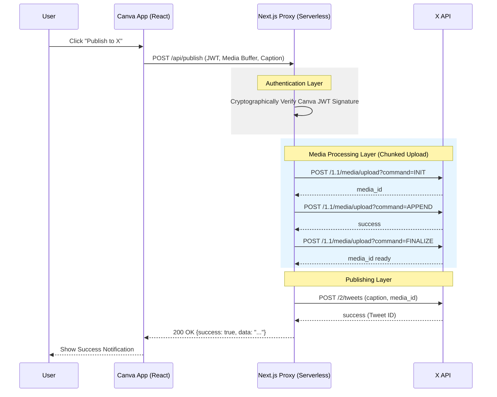

# Architecture Diagrams

## System Component Diagram
This diagram illustrates our "Zero Database" stateless proxy architecture.

## Request Sequence Diagram
This diagram maps the standard execution flow during a "Publish to X" event.

