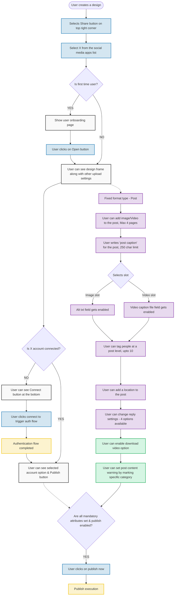

# Visual User Journey Flowcharts

This document provides visual state-machine representations of the textual click-map found in [`user-journeys.md`](./user-journeys.md). It is designed to visually map every constraint, validation boundary, and the exact flow from the finalized canonical workflow document.

## 1. End-to-End Integration Flow

This diagram tracks the UI interactions from the Canva Share Menu through to the final X Publish execution, explicitly mapping the Post Attributes and Settings evaluated before publishing.

