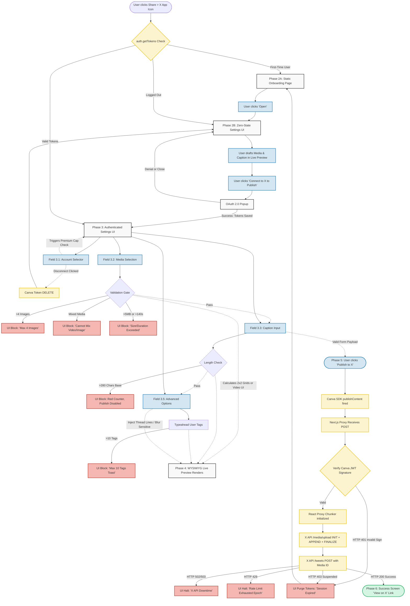
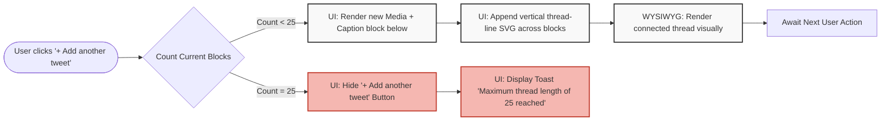

# Visual User Journey Flowcharts

This document provides visual state-machine representations of the textual click-map found in [`user-journeys.md`](./user-journeys.md). It is designed to visually map every constraint, validation boundary, and network exception for the frontend engineering team.

## 1. End-to-End Integration Flow (Happy Path + Exhaustive Exceptions)

This diagram tracks the UI interactions from the Canva Share Menu through to the final X API Network responses, including all explicit HTTP 4xx/5xx handling.

## 2. Dynamic Thread Builder Validation UX

This sub-diagram zooms into the UI logic for Field 3.4 (`+ Add another tweet`), mapping exactly how the UI prevents users from breaking X's maximum thread depth limit natively within Canva.

